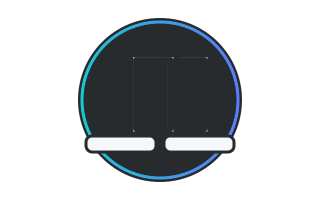
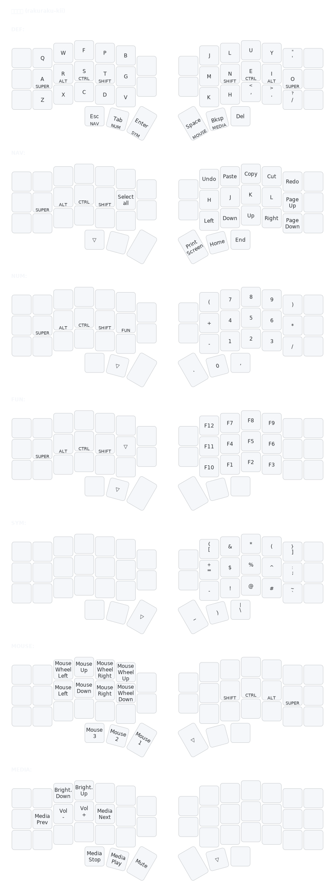

# 楽々キー (rakuraku-kii)

**快適性と実用性を両立した左右分離型向けキー配列**  
_Comfort-driven, practical layout for split ergonomic keyboards._

---

## Overview

**rakuraku-kii** is a comfort-first keymap for split ergonomic boards
It follows a **Colemak-DH** base layer with **Home-Row Mods** and **thumb
layer-taps** for speed, reduced strain, and low travel.

- **Target board:** Any split ergonomic keyboard with minimum layout of 3×5 + 3 thumbs per side (36 keys total).
- **Configurator:** Vial (real-time QMK keymapping; cross-platform).
- **Base layout:** Colemak-DH (ergonomic Colemak variant).
- **Technique:** Home-Row Mods (“mod-taps” on ARST / NEIO).
- **Mechanics:** Thumb layer-taps (tap for key, hold for layer); Navigation/Numeric/Symbols/
  Function/Media/Mouse layers.

> **Inspiration:** Miryoku’s ergonomic principles and layering philosophy.  
> **Rationale:** See **[`docs/rationale.md`](docs/rationale.md)** for detailed decisions.

---

## Design choices (high level)

- **Comfort first:** minimized travel and strain; ergonomic layering.
- **Home-Row Mods (HRMs):** frequent modifiers under resting fingers to avoid
  pinky/hand stretches.
- **Thumb-centric layers:** layer-taps on thumbs keep letters uninterrupted and
  reduce mis-chords.
- **Clear roles per layer:** Base / Nav & editing / Numbers / Function /
  Symbols/ Mouse / Media (+ reserved).
- **Practical, predictable placements:** everyday shortcuts and symbols where the
  hands already are.

<!-- > Full details: see **[`docs/layers.md`](docs/layers.md)** and **[`docs/usage-vial.md`](docs/usage-vial.md)**. -->

---

## Keymap visualization

---

## Acknowledgments

- **Miryoku** for ergonomic & layering principles.
- **Colemak-DH** community for layout research and materials.
- **Corne/crkbd** by foostan for an open split platform.
- **Vial** for live configuration and portability.

---

## License

MIT — see [`LICENSE`](LICENSE)
