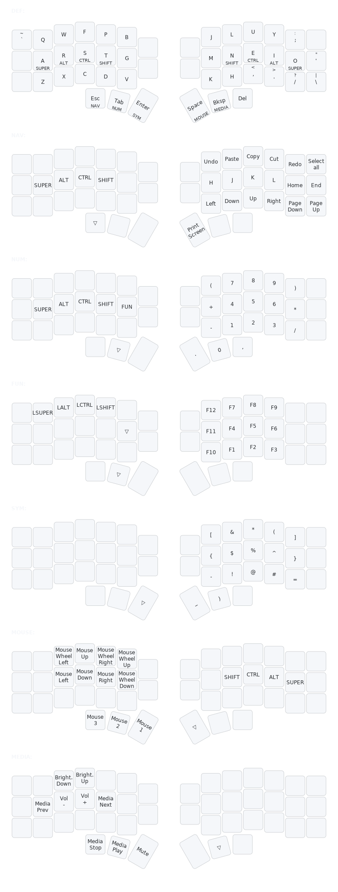

# 楽々キー (rakuraku-kii)

**快適性と実用性を両立した左右分離型向けキー配列**  
_Comfort-driven, practical layout for split ergonomic keyboards._

## Table of Contents

- [Overview](#overview)
- [Design Choices](#design-choices)
- [Keymap Visualization](#keymap-visualization)
- [Documentation](#documentation)
- [Acknowledgments](#acknowledgments)
- [License](#license)

---

## Overview

**rakuraku-kii** is a comfort-first keymap for split ergonomic boards
It follows a **Colemak-DH** base layer with **Home-Row Mods** and **thumb
layer-taps** for speed, reduced strain, and low travel.

- **Target board:** Any split ergonomic keyboard with minimum layout of 3×5 + 3 thumbs per side (36 keys total).
- **Configurator:** Vial (real-time QMK keymapping; cross-platform).
- **Base layout:** Colemak-DH (ergonomic Colemak variant).
- **Technique:** Home-Row Mods (“mod-taps” on ARST / NEIO).
- **Mechanics:** Thumb layer-taps (tap for key, hold for layer); Navigation/Numeric/Symbols/
  Function/Media/Mouse layers.

> **Inspiration:** Miryoku’s ergonomic principles and layering philosophy.  
> **Rationale:** See **[`docs/rationale.md`](docs/rationale.md)** for detailed decisions.

---

## Design choices (high level)

- **Comfort first:** minimized travel and strain; ergonomic layering.
- **Home-Row Mods (HRMs):** frequent modifiers under resting fingers to avoid
  pinky/hand stretches.
- **Thumb-centric layers:** layer-taps on thumbs keep letters uninterrupted and
  reduce mis-chords.
- **Clear roles per layer:** Base / Nav & editing / Numbers / Function /
  Symbols/ Mouse / Media (+ reserved).
- **Practical, predictable placements:** everyday shortcuts and symbols where the
  hands already are.

---

## Keymap visualization

## Documentation

Detailed documentation for each layer is available in the [`docs/`](docs/) directory:

- [`docs/layers-def.md`](docs/layers-def.md) - Base typing layer (Colemak-DH)
- [`docs/layers-nav.md`](docs/layers-nav.md) - Navigation and editing
- [`docs/layers-num.md`](docs/layers-num.md) - Numbers and math operations
- [`docs/layers-fun.md`](docs/layers-fun.md) - Function keys (F1-F12)
- [`docs/layers-sym.md`](docs/layers-sym.md) - Symbols and special characters
- [`docs/layers-mouse.md`](docs/layers-mouse.md) - Keyboard mouse control
- [`docs/layers-media.md`](docs/layers-media.md) - Media and brightness controls

See [`docs/rationale.md`](docs/rationale.md) for the complete design rationale and ergonomic principles.

---

## Acknowledgments

- **Miryoku** for ergonomic & layering principles.
- **Colemak-DH** community for layout research and materials.
- **Corne/crkbd** by foostan for an open split platform.
- **Vial** for live configuration and portability.

---

## License

MIT — see [`LICENSE`](LICENSE)
