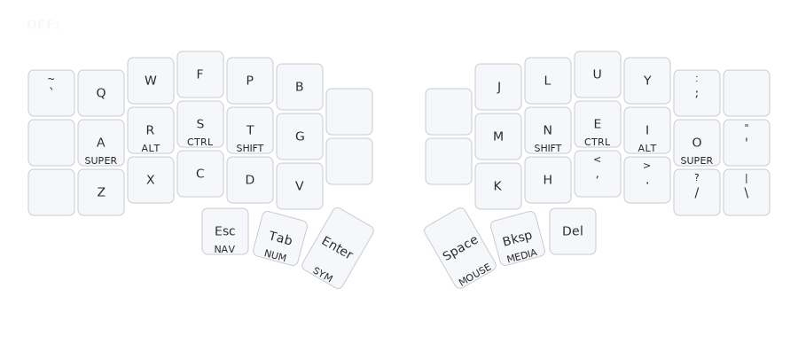

# DEF Layer (Default)

## Overview
The DEF layer is the primary typing layer for everyday text input. It implements Colemak-DH, an ergonomic layout that reduces finger travel and strain compared to QWERTY.

## Access
This is the default (base) layer. It is always active unless another layer is held via a thumb key.

## Key Map

- **Letters**: Colemak-DH placement (e.g., Q W F P B on top row).
- **Punctuation**: Quotes (single/double), comma, dot, question mark/forward slash on base.
- **Thumbs**: Esc, Tab, Enter, Space, Backspace, Delete for frequent actions.

## Rationale
- **Colemak-DH**: Optimizes for common letter combinations with minimal movement, prioritizing home-row access for vowels (A O) and consonants (R S T N E I) to reduce strain.
- **Letter Frequency**: Balances load across fingers, avoiding QWERTY's awkward stretches (e.g., TH/HE combos on home row).
- **Base Focus**: Keeps letters uninterrupted; essentials on thumbs for quick access without layer switches.
- **Ergonomics**: Reduces strain by placing frequent punctuation (comma, dot, quotes) near home row for natural typing flow.
- **Thumb Utilization**: Repetitive actions (Space, Enter, Esc, Backspace) on thumbs leverage natural reach.

## Usage
- Type letters directly in Colemak-DH layout (e.g., "the" as F H E).
- Use thumbs for spacing/entering (e.g., tap Space after words).
- Access punctuation on base for common use (e.g., comma in lists, dot in sentences).
- See [`docs/rationale.md`](rationale.md) for full design details.

## Related Layers
- [`NAV`](layers-nav.md) - Navigation and editing (access via left thumb: Esc)
- [`NUM`](layers-num.md) - Numbers and math (access via right thumb: Tab)
- [`SYM`](layers-sym.md) - Symbols (access via right thumb: Enter)
- [`FUN`](layers-fun.md) - Function keys (access via right thumb: hold Tab + FUN)
- [`MOUSE`](layers-mouse.md) - Mouse control (access via left thumb: Space)
- [`MEDIA`](layers-media.md) - Media controls (access via left thumb: Bksp)</content>
<parameter name="filePath">docs/layers-def.md