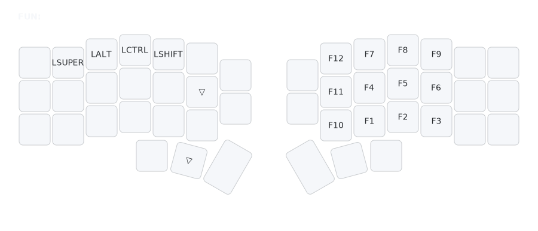

# FUN Layer (Function)

## Overview
The FUN layer provides F1-F12 keys and modifiers for applications requiring function keys.

## Access
Hold **right thumb** (Tab key position, same as NUM layer) along with the FUN key to activate.

## Key Map

- **F-Keys**: F1-F12, aligned with NUM positions (e.g., F7 where 7).
- **Modifiers**: LSuper, LAlt, LCtrl, LShift on left.

## Rationale
- **NUM Consistency**: F-keys tied to their numeric counterparts.
- **Shortcut Support**: Mods enable complex key combos.

## Usage
- Hold NUM thumb key along with FUN key, then tap F-keys.
- Use mods for app-specific shortcuts (e.g., F5 for refresh).
- Useful for debugging, fullscreen, or macros.
- See [`docs/rationale.md`](rationale.md) for full design details.

## Related Layers
- [`DEF`](layers-def.md) - Base layer
- [`NUM`](layers-num.md) - Numbers (access FUN layer by holding NUM + FUN)</content>
<parameter name="filePath">docs/layers-fun.md