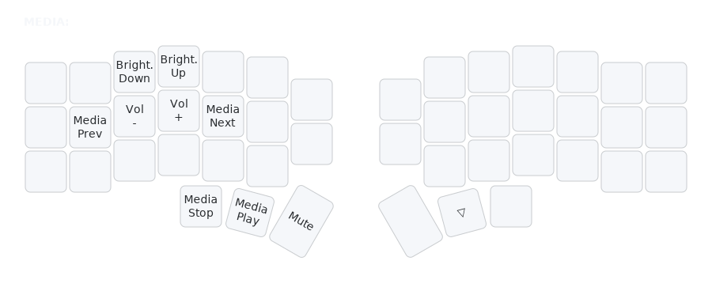

# MEDIA Layer (Media)

## Overview
The MEDIA layer provides controls for audio, video playback, and screen brightness.

## Access
Hold left thumb (Bksp key position) to activate.

## Key Map

- **Playback**: Media Prev, Play/Pause, Next, Stop.
- **Volume**: Vol -, Vol +, Mute.
- **Brightness**: Bright Up/Down.

## Rationale
- **Essential Controls**: Quick access to media without external remotes.
- **Intuitive Layout**: Common functions grouped logically.

## Usage
- Hold thumb, tap playback keys for music/video control.
- Use volume for audio adjustments, brightness for screen.
- Ideal for media-heavy tasks.
- See [`docs/rationale.md`](rationale.md) for full design details.

## Related Layers
- [`DEF`](layers-def.md) - Base layer
- [`MOUSE`](layers-mouse.md) - Mouse layer (often used during media tasks)</content>
<parameter name="filePath">docs/layers-media.md