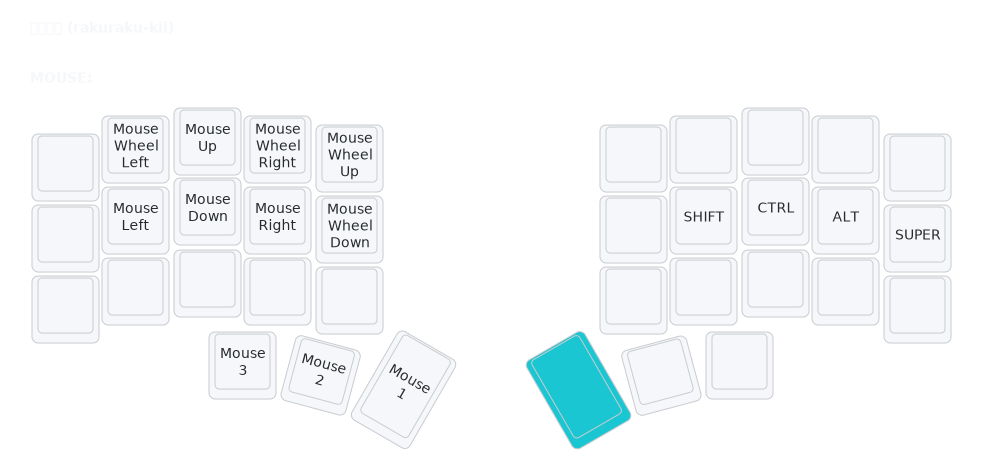

# MOUSE Layer (Mouse)

## Overview
The MOUSE layer provides keyboard-based mouse control for situations without a physical mouse.

## Access
Hold left thumb (Space key position) to activate.

## Key Map

- **Directional Movement**: Mouse Left/Down/Up/Right.
- **Wheel**: Wheel Left/Up/Right/Down for scrolling.
- **Clicks**: Mouse 1/2/3 buttons.
- **Mods**: Shift, Ctrl, Alt, Super for selections/drags.

## Rationale
- **Versatility**: Backup mouse control in mouse-less environments.
- **Precision Mods**: Mods enable selections and drags.

## Usage
- Hold thumb, use directional keys for movement, wheel for scrolling.
- Tap clicks; hold mods + movement for selections.
- Rarely used, but handy for media or remote work.
- See [`docs/rationale.md`](rationale.md) for full design details.

## Related Layers
- [`DEF`](layers-def.md) - Base layer
- [`NAV`](layers-nav.md) - Navigation layer (frequently used together)</content>
<parameter name="filePath">docs/layers-mouse.md