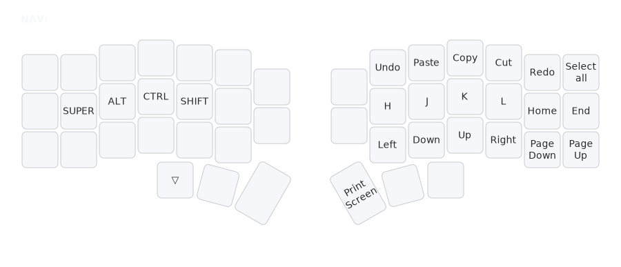

# NAV Layer (Navigation)

## Overview
The NAV layer provides movement, editing, and shortcuts for efficient text manipulation without leaving the keyboard.

## Access
Hold left thumb (Esc key position) to activate.

## Key Map

- **Vim Movement**: H J K L for left/down/up/right.
- **Arrows**: Full directional arrows with Page Up/Down and Home/End.
- **Editing Shortcuts**: Undo (Ctrl+Z), Paste (Ctrl+V), Copy (Ctrl+C), Cut (Ctrl+X), Redo (Ctrl+Y), Select All (Ctrl+A).
- **Extras**: Print Screen.

## Rationale
- **Vim-Style Navigation**: HJKL placement mirrors vim for muscle memory in editors/IDEs, enabling fast cursor movement.
- **Arrow Placement**: Full arrows with Page/Home/End for extended navigation, grouped for logical access.
- **Hand Balance**: Layer access on left, actions on right to avoid cross-body stretches and maintain flow.
- **Shortcut Frequency**: Common editing combos (Undo, Copy, Paste) placed for quick access without modifier gymnastics.
- **Ergonomic Efficiency**: Reduces mouse reliance, promoting keyboard-centric workflows.

## Usage
- Hold thumb, tap H/J/K/L for vim-like movement (e.g., J for down in text).
- Use arrows for precision (e.g., Right for character navigation).
- Access editing shortcuts directly (e.g., Ctrl+Z for undo, Ctrl+C for copy).
- Combine with HRMs for advanced navigation.
- See [`docs/rationale.md`](rationale.md) for full design details.</content>
<parameter name="filePath">docs/layers-nav.md