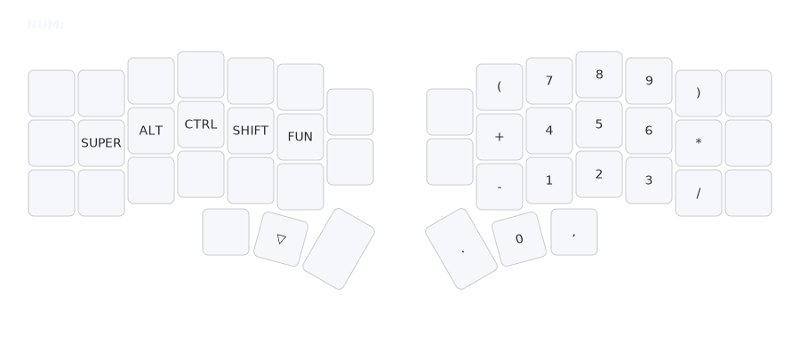

# NUM Layer (Numbers)

## Overview
The NUM layer provides numbers, math operators, and access to the FUN layer for calculations and function keys.

## Access
Hold right thumb (Tab key position) to activate.

## Key Map

- **Numbers**: Numpad-style layout (1-9 under right hand, 0 on thumb).
- **Math Operators**: +, -, *, /, (, ), . , ,
- **Extras**: Access to FUN layer (F-keys).

## Rationale
- **Numpad Familiarity**: Layout mirrors physical numpads for ease.
- **Quick Math**: Operators enable fast calculations (e.g., 1+2*3) without switching layers.
- **FUN Integration**: Numbers link to F1-F12 for consistency.

## Usage Tips
- Hold thumb, then tap numbers/operators for input.
- Use . for decimals, , for commas in numbers.
- Switch to FUN via inner thumb for F-keys.
- See [`docs/rationale.md`](rationale.md) for full design details.</content>
<parameter name="filePath">docs/layers-num.md