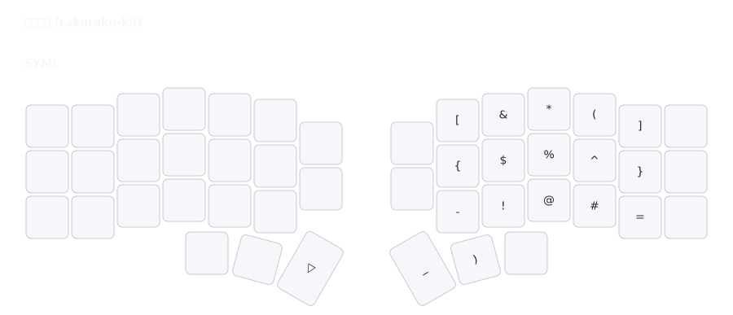

# SYM Layer (Symbols)

## Overview
The SYM layer provides special characters, punctuation, and symbols for programming and text.

## Access
Hold right thumb (Enter key position) to activate.

## Key Map

- **Symbols**: Brackets ([ ]), operators (+ =), specials (& * ^ % $).
- **Punctuation**: :, ;, ` ~, _ , |
- **Mods**: Super, Alt, Ctrl, Shift on left for combos.

## Rationale
- **NUM Consistency**: Symbols mirror numbers (e.g., ! @ # where 1 2 3) for muscle memory and reduced learning curve.
- **Symbol Frequency**: Groups high-use chars ([ ] { } : ;) centrally to minimize switches.
- **Centralized Access**: Majority of symbols on one layer for focused, predictable access.
- **Bracket Pairing**: Related pairs (e.g., ( ), [ ], { }) placed logically for coding.
- **Hand Balance**: Mods on left enable combos, symbols on right for primary input.

## Usage
- Hold thumb, tap symbols in alignment (e.g., @ where 2 is).
- Access brackets for coding (e.g., [ ] for arrays).
- Use mods for shortcuts (e.g., Ctrl + { for code folding).
- See [`docs/rationale.md`](rationale.md) for full design details.</content>
<parameter name="filePath">docs/layers-sym.md