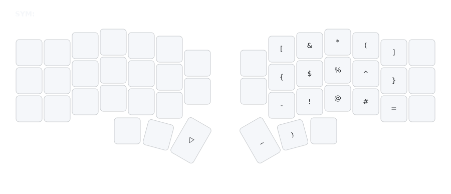

# SYM Layer (Symbols)

## Overview
The SYM layer provides special characters, punctuation, and symbols for programming and text.

## Access
Hold right thumb (Enter key position) to activate.

## Key Map

- **Symbols**: Brackets ([ ]), operators (+ =), specials (& * ^ % $).
- **Punctuation**: :, ;, ` ~, _ , |
- **Mods**: Super, Alt, Ctrl, Shift on left for combos.

## Rationale
- **NUM Consistency**: Symbols align with numbers (e.g., ! @ # where 1 2 3) for muscle memory.
- **Centralized Access**: Groups common symbols to reduce layer switches.
- **Hand Balance**: Mods on left, symbols on right.

## Usage Tips
- Hold thumb, tap for symbols (e.g., { } for code blocks).
- Use left mods + symbols for shortcuts.
- For Python, _ on thumb for snake_case.
- See [`docs/rationale.md`](rationale.md) for full design details.</content>
<parameter name="filePath">docs/layers-sym.md